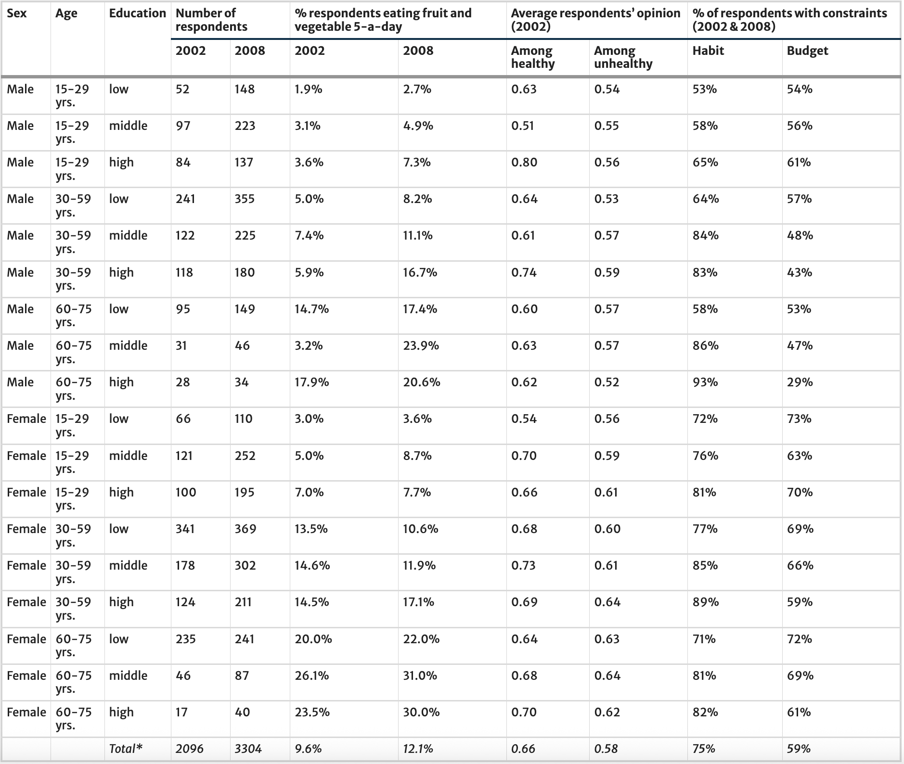
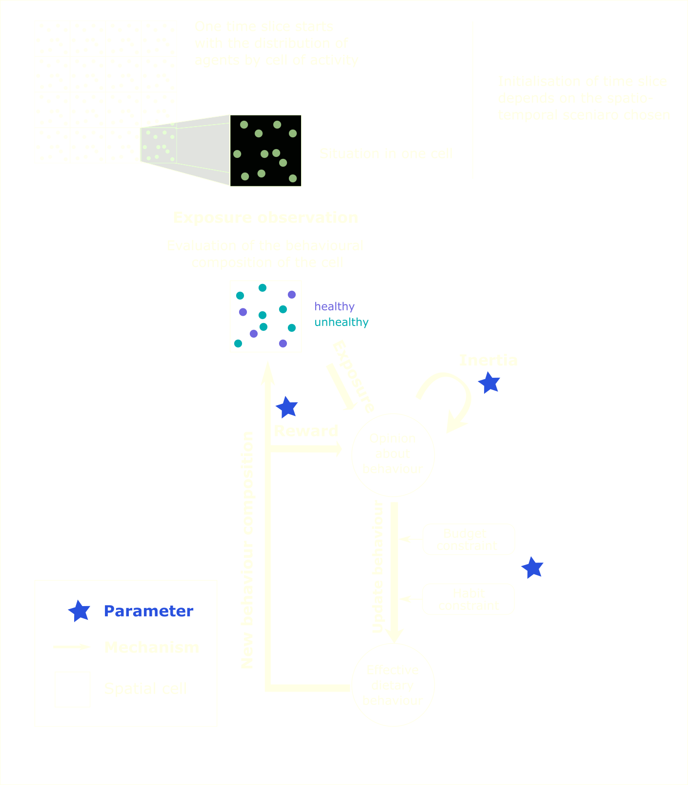

## Vicious cycle/circles of segregation

-   Social segregation in cities refers to the uneven spatial distribution of individuals from different social groups.

-   It is reproduced through the unequal resources, networks and preferences of individuals of different sociodemographic groups [@krysan2017cycle]

-   Segregation itself produces social inequalities through contextual effects across life domains [@tammaru2021spatial]

## Beyond Static Segregation

Segregation and contextual effects differ throughout the day, as people move between locations in a city.

> Effects of spatial segregation on social outcomes need to be studied temporally (“around the clock”).

In this article, we aim to understand the effects of spatio-temporal social segregation on the diffusion of dietary behaviours, using an empirical agent-based model initialised on the Paris region.

## Study design

-   we build a (mobile) synthetic population with data from two health & nutrition surveys conducted 6 years apart, data from the French census and origin-destination survey.

-   we combine scenarios of residential patterns with scenarios of daily mobility

| Location | 1A     | 1B     | 2A       | 2B     | 2C   |
|----------|--------|--------|----------|--------|------|
| Night    | Random | Random | Observed | Obs.   | Obs. |
| Day      | /      | Random | /        | Random | Obs. |

## Synthetic data {.scrollable .smaller}

\~8.77M agents, 16 sociodemographic groups, 8325 cells (1 km × 1 km)

{width="100%," fig-align="centre"}

## Health data 🍓🥒🥑🍉🫛

{width="100%," fig-align="centre"}

## Measuring inequality and segregation

$$
EII_{t} = {\sum _{sex=1}^{2}{\sum _{age=1}^{3}{ ( \frac{\%healthy_{sex,age,edu=3, t}}{\%healthy_{sex,age,edu=1, t}} \times \frac{N_{sex,age}}{N}}})}
$$

```{r}
#| dev-args: 
#|   bg: "transparent"
#| classes: styled-output

library(tidyverse)
empirical <- data.frame(EII = c(1.408, 1.895),
                        PropHealthy = c(9.6, 12.1),
                        year = c(2002, 2008))
ggplot(empirical)+
  annotate("segment", x = 9.6, xend = 12.1, yend = 1.895, y = 1.408,
  colour = alpha("#b289c2", 0.6), size = 1.2)+
  geom_point(aes(y=EII, x = PropHealthy, 
                  color = factor(year)), size = 6) +
  xlim(0, 15) + ylim(1,2) +
  guides(colour=guide_legend(title="Year", colour = "white")) +
  theme_dark(paper = "transparent") +
  theme(axis.line = element_line(colour = "beige"),
     panel.grid.major = element_blank(),
     panel.grid.minor = element_blank(),
     panel.border = element_blank(),
     panel.background = element_blank(),
     plot.background = element_rect(fill = "#526d7b", color = NA),
     text=element_text(size=26, colour = "beige"),
     axis.text = element_text(size=20, colour = "beige"))
  
```

## Model initialisation

Agent attributes:

::: {layout-ncol="2"}
<div>

-   sex
-   age
-   education level
-   ‘night’ cell
-   ‘day’ cell
-   ‘evening’ cell

</div>

<div>

-   probability of eating 🍎🫐🍋🍠🥦 (according to sociodemographic group)
-   probability of opinion towards 🍐🥕🫑🥥🍅 (according to sociodemographic group)
-   contraints (budget and/or habits)

</div>
:::

## Model Dynamics {.scrollable .smaller}

::: {layout-ncol="2"}
<div>



</div>

<div>

3 day-parts

x 6 years

= 18 calibration steps (\~20min)

------------------------------------------------------------------------

-   Calibration process to minimise $\Delta_{EII}$ and $\Delta_{PHealthy}$
-   Optimisation method with adaptive rejection zones to find maximally diverse "good" parameter values

= 900,000 executions [OpenMole](https://openmole.org/)

</div>
:::

## Results inequality

```{r}
sim <- read.csv2("figures/results-25042022-10000replications.csv", sep=",", dec=".")
sim$Scenario <- ifelse(sim$numOfScenario == 1, "1A: Random residence / no move",
                       ifelse(sim$numOfScenario == 2, "1B: Random residence / random moves",
                              ifelse(sim$numOfScenario == 3, "2A: Observed residence / no move",
                                     ifelse(sim$numOfScenario == 4, "2B: Observed residence / random moves",
                                            "2C: Observed residence / observed moves"))))


mean_1A <- mean(sim[sim$numOfScenario == 1,"socialInequality"])
mean_1B <- mean(sim[sim$numOfScenario == 2,"socialInequality"])
mean_2A <- mean(sim[sim$numOfScenario == 3,"socialInequality"])
mean_2B <- mean(sim[sim$numOfScenario == 4,"socialInequality"])
mean_2C <- mean(sim[sim$numOfScenario == 5,"socialInequality"])

sim %>%
  ggplot( aes(x=socialInequality, group=Scenario, fill=Scenario)) +
  geom_vline(xintercept=1.405, size=1, color="grey80", linetype = "dashed") +
  geom_density(alpha=0.6) +
  scale_fill_manual(values=c("firebrick2", "mediumorchid4", "dodgerblue2", "darkorange2", "springgreen3"))+
  geom_vline(xintercept=mean_1A, size=0.4, color="firebrick2") +
  geom_vline(xintercept=mean_1B, size=0.4, color="mediumorchid4") +
  geom_vline(xintercept=mean_2A, size=0.4, color="dodgerblue2") +
  geom_vline(xintercept=mean_2B, size=0.4, color="darkorange2") +
  geom_vline(xintercept=mean_2C, size=0.4, color="springgreen3") +
  annotate("text", x=mean_1A - 0.004, y= -10, size=3, label=round(mean_1A,3), color="firebrick2") +
  annotate("text", x=mean_1B - 0.004 , y= -10, size=3, label=round(mean_1B,3), color="mediumorchid4") +
  annotate("text", x=mean_2A - 0.004 , y= -10, size=3, label=round(mean_2A,3), color="dodgerblue2") +
  annotate("text", x=mean_2B + 0.004 , y= -10, size=3, label=round(mean_2B,3), color="darkorange2") +
  annotate("text", x=mean_2C + 0.004, y= -10, size=3, label=round(mean_2C,3), color="springgreen3") +
  annotate("text", x=1.405 + 0.013, y= 115, size=3, label="Value at initialisation", color="grey80") +
  xlab("Social Inequality Index (EII)") +
  ylab("Number of simulations") + 
  xlim(1.35,1.6) +
  guides(fill=guide_legend(title="Type of scenario",nrow=2,byrow=TRUE)) +
  theme_dark(paper = "transparent") +
  theme(legend.position = "bottom",
        axis.line = element_line(colour = "beige"),
     panel.grid.major = element_blank(),
     panel.grid.minor = element_blank(),
     panel.border = element_blank(),
     plot.background = element_rect(fill = "#526d7b", color = NA),
      panel.background = element_blank(),
     text=element_text(size=12, colour = "beige"),
     axis.text = element_text(size=10, colour = "beige"))

```

## Results inequality

```{r}
random_moves <- read.csv("random_moves.csv")

annotation <- data.frame(
   x = c(0,1),
   y = c(1.57,1.46),
   label = c("Scenario 2C", "Scenario 2B")
)


ggplot(random_moves, aes(x=randomMoveRatio, y=socialInequality)) +
    geom_hline(yintercept = 1.424, color = "darkorange2") +
  geom_hline(yintercept = 1.536, color = "springgreen3") +
  geom_violin(aes(group=randomMoveRatio, fill=randomMoveRatio)) +
  geom_point(size=0.05) +
  scale_fill_gradient(
    low = "springgreen3", 
    high = "darkorange2"
    ) + 
  geom_text(data=annotation, aes(x=x, y=y, label=label),
            colour = c("springgreen3","darkorange2"),
           size=4 , angle=0, fontface="bold") +
 ylim(1.35,1.6) +
  guides(fill="none") +
  xlab("Proportion of random moves") +
  ylab("Social inequality index (EII)")+
  theme_dark(paper = "transparent") +
  theme(legend.position = "bottom",
        axis.line = element_line(colour = "beige"),
     panel.grid.major = element_blank(),
     panel.grid.minor = element_blank(),
     panel.border = element_blank(),
     plot.background = element_rect(fill = "#526d7b", color = NA),
      panel.background = element_blank(),
     text=element_text(size=12, colour = "beige"),
     axis.text = element_text(size=10, colour = "beige"))
```

## Results health behaviour

```{r}
mean_1A <- mean(sim[sim$numOfScenario == 1,"numberOfHealthy"]/8778898)
mean_1B <- mean(sim[sim$numOfScenario == 2,"numberOfHealthy"]/8778898)
mean_2A <- mean(sim[sim$numOfScenario == 3,"numberOfHealthy"]/8778898)
mean_2B <- mean(sim[sim$numOfScenario == 4,"numberOfHealthy"]/8778898)
mean_2C <- mean(sim[sim$numOfScenario == 5,"numberOfHealthy"]/8778898)
 
  
sim %>%
 ggplot( aes(x=numberOfHealthy/8778898, group=Scenario, fill=Scenario)) +
  geom_vline(xintercept=0.0957, size=1, color="grey80", linetype = "dashed") +
  geom_density(alpha=0.6) +
  scale_fill_manual(values=c("firebrick2", "mediumorchid4", "dodgerblue2", "darkorange2", "springgreen3"))+
  geom_vline(xintercept=mean_1A, size=0.4, color="firebrick2") +
  geom_vline(xintercept=mean_1B, size=0.4, color="mediumorchid4") +
  geom_vline(xintercept=mean_2A, size=0.4, color="dodgerblue2") +
  geom_vline(xintercept=mean_2B, size=0.4, color="darkorange2") +
  geom_vline(xintercept=mean_2C, size=0.4, color="springgreen3") +
  annotate("text", x=mean_1A + 0.001, y= -50, size=3, label=round(mean_1A,3), color="firebrick2") +
  annotate("text", x=mean_1B - 0.001 , y= -50, size=3, label=round(mean_1B,3), color="mediumorchid4") +
  annotate("text", x=mean_2A + 0.001 , y= -50, size=3, label=round(mean_2A,3), color="dodgerblue2") +
  annotate("text", x=mean_2B + 0.001 , y= -50, size=3, label=round(mean_2B,3), color="darkorange2") +
  annotate("text", x=mean_2C + 0.0005, y= -50, size=3, label=round(mean_2C,3), color="springgreen3") +
  annotate("text", x=0.0957 + 0.005, y= 115, size=3, label="Value at initialisation (0.0957)", color="grey80") +
   xlab("Share of agents with a healthy diet") +
  ylab("Number of simulations") + 
  xlim(0.07,0.15) +
  guides(fill=guide_legend(title="Type of scenario",nrow=2,byrow=TRUE)) +
  theme_dark(paper = "transparent") +
  theme(legend.position = "bottom",
        axis.line = element_line(colour = "beige"),
     panel.grid.major = element_blank(),
     panel.grid.minor = element_blank(),
     panel.border = element_blank(),
     plot.background = element_rect(fill = "#526d7b", color = NA),
      panel.background = element_blank(),
     text=element_text(size=12, colour = "beige"),
     axis.text = element_text(size=10, colour = "beige"))

```

## Results health behaviour {.scrollable .smaller}

{height="100%"}

## Main findings

-   Random locations (residence and/or daily moves) lead to a greater mix of people’s opinions/behaviours, and to lower social inequality over time

> Mixing social groups during the day mitigates social inequalities induced by residential segregation (even small proportion of random moves)

-   Daytime mobility and segregation in Paris reinforces the unequal distribution of health behaviours between the most and least educated groups compared to scenario with residential segregation only.

## Discussion

::: {layout-ncol="2"}
<div>

-   agents do not evolve
-   mechanisms left aside (interpersonal influence, life course tipping points, environments, perception)
-   opnion dynamic model = basic
-   hybrid temporality (3 day parts per year)

</div>

<div>

-   A reusable [library for synthetic population generation](https://eighties-cities.github.io/h24/)

-   A new way to explore vulnerabilities combining survey-based data and agent-based modelling

-   Data-driven exploratory model

-   Neighbourhood effects around the clock

</div>
:::

## Conclusion {.scrollable .smaller}

1.  "beyond static segregation": daily activities at various locations affect individuals’ social exposure, interactions and behaviours, yet local policies most often consider only residential segregation

2.  national health campaigns promote healthy behaviours but pay less attention to equity concerns between social groups (concentration of benefits better-offs).

> Need to retain complexity on the social, spatial and temporal dimensions, using millions of artificial agents moving and interacting in a realistically-sized artificial urban space

Our model reproduces:

-   diffusion of dietary behaviours across the entire population
-   emergence of distinct diffusion patterns within social groups

For more: [@cottineau2025agent]

## References {.scrollable .smaller style="font-size: 40px"}

::: {#refs}
:::

## More about...

::: {layout-ncol="3"}

<div>

This paper: 


</div>

<div>

This presentation: 


</div>

<div>

[ERC-SEGUE.nl](http://erc-segue.nl)


</div>
:::
